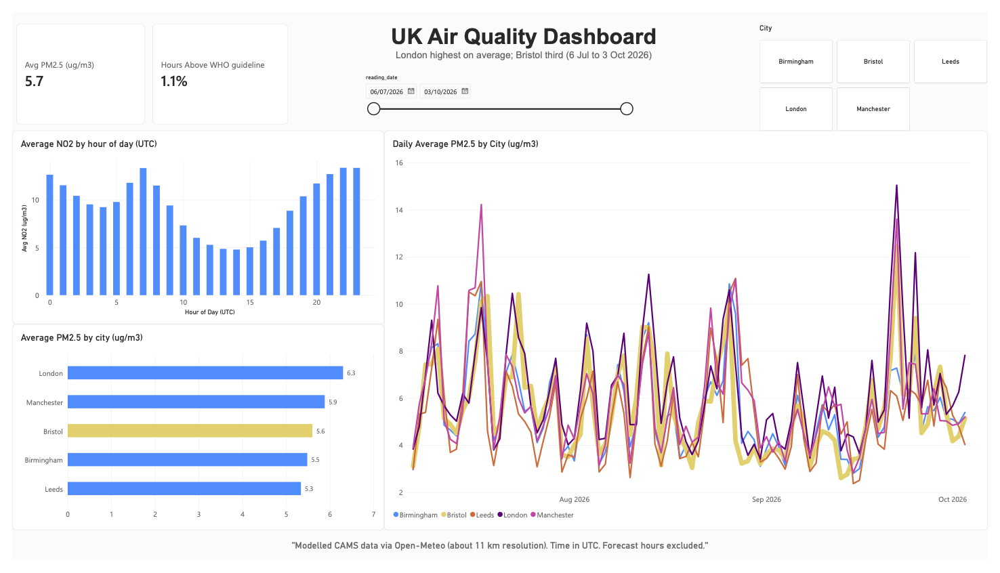

# UK Air Quality Data Pipeline

An automated ETL pipeline that collects hourly air-quality data for five UK cities, cleans and
validates it, and loads it into Azure SQL Database. A scheduled GitHub Actions workflow runs it
every day, and a Power BI dashboard sits on top of the data.

**Business question:** How does air quality in Bristol compare with other major UK cities?

**Tech stack:** Python (pandas, requests, pymssql), SQL (Azure SQL Database in production,
SQLite locally), pytest, GitHub Actions, Power BI

## Key findings

Findings cover 6 July to 3 October 2026 (about 2,160 hourly readings per city, forecast hours excluded).

| City | Average PM2.5 (ug/m3) |
|---|---|
| London | 6.3 |
| Manchester | 5.9 |
| **Bristol** | **5.6** |
| Birmingham | 5.5 |
| Leeds | 5.3 |

- London had the highest average PM2.5, and Bristol ranked third of five.
- Across all five cities, about 1.1% of hours were above the WHO 24-hour guideline of 15 ug/m3,
  and every city's average was well below it.
- The differences between cities are small, and the window covers only about three months of
  summer and autumn, so this is a snapshot and not a full-year picture.
- Modelled NO2 follows a daily cycle: roughly 13 ug/m3 around 07:00 UTC and again late evening,
  and about 5 ug/m3 in the early afternoon. Because the data is modelled at about 11 km
  resolution, this shows a regional pattern and not street-level traffic effects.

## Dashboard



[Download the dashboard as a PDF](dashboard/air_quality_dashboard.pdf)

A Power BI report built on the Azure SQL database. It reads a view with ready-made date and hour
fields, and uses DAX measures for the headline figures.

```sql
CREATE OR ALTER VIEW dbo.vw_air_quality AS
SELECT city,
       [time]                    AS reading_time,
       CAST([time] AS date)      AS reading_date,
       DATEPART(hour, [time])    AS hour_utc,
       DATENAME(weekday, [time]) AS weekday_name,
       pm10, pm2_5, nitrogen_dioxide, ozone, above_who_pm25
FROM dbo.air_quality;
```

It shows average PM2.5 and the share of hours above the WHO guideline, PM2.5 by city (Bristol
highlighted), a daily PM2.5 trend per city, NO2 by hour of day, and city and date-range selectors.
The dashboard is a snapshot taken at export time, because it reads Azure in Import mode and
needs a manual refresh.

## How it works

```
Open-Meteo Air Quality API --> extract.py --> transform.py --> load_azure.py --> Azure SQL Database --> Power BI
      (hourly JSON)            fetch + retry   clean + validate  MERGE upsert      air_quality
                                                                                   pipeline_runs
                                       ^
                        GitHub Actions: run tests, then the pipeline, every day
```

- **Extract:** requests hourly PM10, PM2.5, nitrogen dioxide and ozone for each city, with
  timeouts and automatic retries.
- **Transform:** standardises timestamps to UTC, forces numeric types, sets impossible values
  (negative or above 1000 ug/m3) to NULL, and removes empty and duplicate rows. It also adds a
  simple `above_who_pm25` flag.
- **Load:** upserts into Azure SQL Database with a T-SQL `MERGE`, using `(city, time)` as the
  primary key, so re-running the pipeline never creates duplicates (idempotent). The same
  pipeline loads into a local SQLite file when no Azure settings are present.
- **Resilience:** the free serverless Azure database pauses when idle, so the connection step
  retries while it wakes up. One failing city does not stop the others.
- **Monitoring:** every run is logged per city in a `pipeline_runs` table.
- **Testing:** 7 pytest tests cover cleaning, idempotent loading, failure handling and the
  Azure upsert logic.
- **Automation:** a GitHub Actions workflow runs the tests and the pipeline daily at 06:00 UTC.
  Database credentials are stored as GitHub Actions secrets, never in the code.

## Project structure

```
etl/            config.py, extract.py, transform.py, load.py (SQLite), load_azure.py (Azure SQL)
tests/          test_pipeline.py, test_azure_load.py
sql/            analysis.sql (aggregation, window function, CTE and join examples, SQLite syntax)
dashboard/      Power BI dashboard (PNG and PDF exports)
data/           air_quality.db (local SQLite snapshot from the initial backfill)
run_pipeline.py entry point
.github/workflows/daily.yml
```

## Run it yourself

**Locally (SQLite):**

```bash
pip install -r requirements.txt
pytest -q
python run_pipeline.py --past-days 90   # one-off backfill of recent history
python run_pipeline.py                  # normal run (last 2 days)
```

**Against your own Azure SQL Database:** set these environment variables before running
`python run_pipeline.py`. The tables are created automatically on the first run.

```
AZURE_SQL_SERVER     e.g. your-server.database.windows.net
AZURE_SQL_DATABASE   e.g. airquality
AZURE_SQL_USER
AZURE_SQL_PASSWORD
```

In GitHub, add the same four names as repository secrets. The workflow can also be started
manually from the Actions tab, with a `past_days` input for a backfill.

Example queries are in `sql/analysis.sql`. They use SQLite syntax (for example `strftime`),
so some functions need translating for T-SQL.

## Data source and limitations

Data comes from the [Open-Meteo Air Quality API](https://open-meteo.com/en/docs/air-quality-api).
Values are modelled estimates from the Copernicus Atmosphere Monitoring Service (CAMS) European
air-quality model at roughly 11 km resolution, not readings from ground sensors. Each city is
therefore represented by one model grid cell, so results describe regional air quality rather
than street-level conditions.

`above_who_pm25` marks hours where PM2.5 exceeds the WHO 2021 24-hour guideline of 15 ug/m3.
The guideline is defined for 24-hour averages, so applying it to hourly values is a simple
indicator, not an official compliance measure.

**Known limitation:** the Azure load runs one `MERGE` per row, so a 90-day backfill takes
around 20 minutes. The daily run (about 72 hours per city) is much faster.

Attribution: contains data from CAMS ENSEMBLE (Copernicus Atmosphere Monitoring Service),
accessed via Open-Meteo.

## Next steps

- Batch the `MERGE` statements to make large backfills much faster.
- Compare weekdays with weekends in the NO2 daily cycle.
- Translate the example SQL queries to T-SQL.

## Author

Muhammad Usman Khan